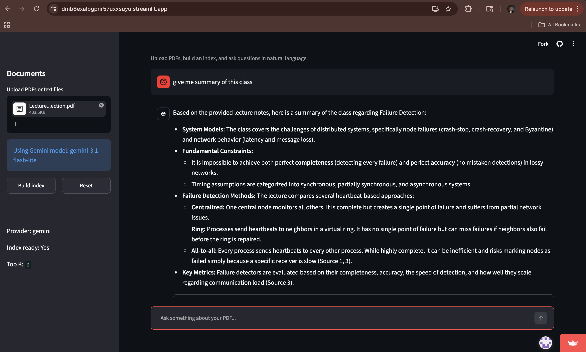
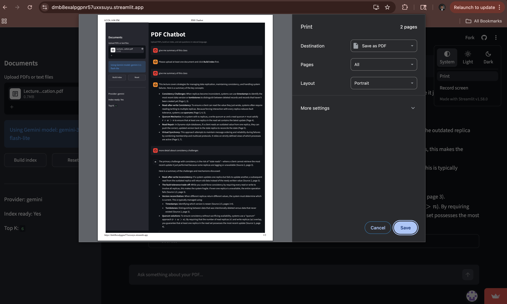
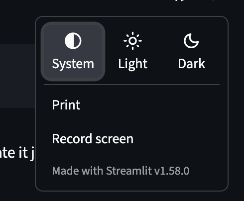

# Data-Aware RAG Bot

A PDF chatbot built with Streamlit. Users can upload a document, build an index, and ask questions about the uploaded content.

Live app: https://dmb8exalpgpnr57uxxsuyu.streamlit.app/

Source code: https://github.com/dp24723/Data-Aware-RAG-bot-

## About

This project is a document question-answering app. It extracts text from uploaded PDFs or text files, creates a searchable index, and uses Gemini to answer questions based on the document content.

I built this project to make it easier to search, summarize, and understand long documents without manually reading page by page.

## How to use

1. Open the live app.
2. Upload a PDF, TXT, or Markdown file from the sidebar.
3. Click **Build index**.
4. Wait for the indexing process to finish.
5. Type your question in the chat box.
6. The app will generate an answer based on the uploaded document.
7. Open the **Sources** section to check the text used for the answer.

Example questions:

- Give me a summary of this document.
- What is the email address in this resume?
- What projects are mentioned?
- What technical skills are listed?
- Summarize the experience section.

## Features

- Upload PDF, TXT, and Markdown files
- Build a searchable document index
- Ask questions in a chat interface
- Generate answers using Gemini
- Show source snippets used for each answer
- Run locally or deploy on Streamlit Community Cloud

## Tech stack

- Python
- Streamlit
- Gemini API
- PyPDF
- NumPy
- Scikit-learn
- Docker

## Project structure

app.py is the main Streamlit application.

The core logic is inside the src/pdf_chatbot folder:

- document_loader.py extracts text from uploaded files
- store.py builds and searches the document index
- answer.py generates answers using retrieved context
- config.py handles app settings
- embeddings.py handles text representation

## Run locally

Clone the repository:

git clone https://github.com/dp24723/Data-Aware-RAG-bot-.git

cd Data-Aware-RAG-bot-

Create a Python environment:

conda create -n raglive python=3.11 -y

conda activate raglive

Install dependencies:

python -m pip install --upgrade pip

python -m pip install -r requirements.txt

Create a local Streamlit secrets file:

mkdir -p .streamlit

touch .streamlit/secrets.toml

Add your Gemini key inside .streamlit/secrets.toml:

LLM_PROVIDER = "gemini"
GEMINI_API_KEY = "YOUR_GEMINI_API_KEY"
GEMINI_MODEL = "gemini-3.1-flash-lite"
PDF_CHAT_STORAGE = "storage"
TOP_K = "6"

Start the app:

python -m streamlit run app.py

Open:

http://localhost:8501

## Deployment

The app is deployed on Streamlit Community Cloud.

For deployment, add the Gemini API key in Streamlit Cloud under:

App settings → Secrets

Use this format:

LLM_PROVIDER = "gemini"
GEMINI_API_KEY = "YOUR_GEMINI_API_KEY"
GEMINI_MODEL = "gemini-3.1-flash-lite"
PDF_CHAT_STORAGE = "storage"
TOP_K = "6"

The main file path is:

app.py

## Security

API keys are not included in this repository.

Do not commit these files or folders:

- .env
- .streamlit/secrets.toml
- storage/
- __pycache__/
- .venv/

## Future work

- Add DOCX support
- Improve retrieval ranking
- Add chat history export
- Support multiple document collections
- Add persistent storage for indexed documents
